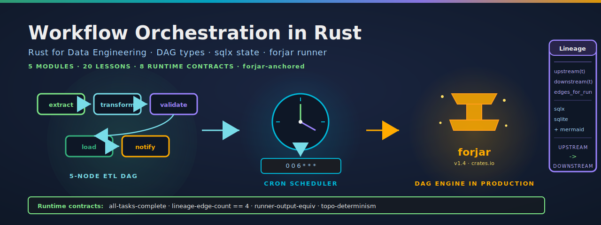

<p align="center">
  
</p>

[](https://github.com/paiml/rust-workflow-orchestration/actions/workflows/ci.yml)
[](#license)
[](rust-toolchain.toml)
[](Makefile)
[](contracts/)

# rust-workflow-orchestration

Companion repo for **Workflow Orchestration with Rust**, a course in the Coursera **Rust for Data Engineering** specialization (Pragmatic AI Labs · Noah Gift). Five modules, twenty lessons, end-to-end from `petgraph` DAG types to a 5-task ETL pipeline running on either an in-process `LocalRunner` or [`forjar`](https://crates.io/crates/forjar)'s production DAG engine.

## What's in this repo

- `crates/dag-core/` — `Dag<T>` on top of `petgraph`, the `Task` trait + `Context`, `topo_sort`, `cycle_check`, and the `DagSpec` YAML deserializer
- `crates/dag-scheduler/` — `tokio-cron-scheduler` 0.15 wrapper that triggers DAG runs on cron expressions and exposes `next_fire`
- `crates/dag-runner/` — two execution backends: `LocalRunner` walks the topo order in-process and persists state to `sqlx`/SQLite; `ForjarRunner` (feature-gated on `forjar`) wraps the published `forjar` CLI to execute the same DAG topology
- `crates/dag-lineage/` — `LineageStore` newtype around an `sqlx` SQLite pool with `query_upstream`, `query_downstream`, and Mermaid rendering
- `crates/dag-cli/` — `clap` binary `dag` with subcommands `validate`, `run --runner local|forjar`, `schedule --cron`, `lineage`, `backfill`. The `etl_pipeline_dag` example under `crates/dag-cli/examples/` is the closing demo
- `compose.yml` — optional Postgres backend used by the M5 production-hardening lesson; the closing demo runs without docker
- `contracts/dag-rust-v1.yaml` — eight provable contracts the runtime asserts enforce, lintable with `pv lint contracts/`

## Quick start

```bash
git clone https://github.com/paiml/rust-workflow-orchestration
cd rust-workflow-orchestration
make demo                     # 5-task ETL via LocalRunner only — no docker, no forjar required
cargo install forjar --locked # one-time, ~2 minutes
make demo-forjar              # same DAG, executed by both LocalRunner and ForjarRunner
```

Run `make help` to see every target. The closing demo writes its scratch directory to `/tmp/etl-pipeline-dag-*` and records lineage into a temp SQLite file — `make clean` removes both. The Makefile is `bashrs lint`-clean (run `make lint-bash` to verify).

## Two runners

The orchestration layer is the same in both cases — `Dag<T>` from `dag-core`, `LineageStore` from `dag-lineage`, the four runtime contracts. Only the executor changes.

### `LocalRunner` — in-process

```rust
use dag_core::Dag;
use dag_lineage::LineageStore;
use dag_runner::{LocalRunner, Runner};

let dag = build_etl_dag(&workdir)?;
let lineage = LineageStore::open(workdir.join("lineage.sqlite")).await?;
let runner = LocalRunner::new(dag, lineage, workdir.join("scratch"));
let report = runner.run("local-run").await?;
assert!(report.all_succeeded());
```

`LocalRunner` walks the topo order, executes each `Task` in-process via `tokio`, and records every `Queued`/`Running`/`Succeeded`/`Failed`/`Skipped` transition to the lineage store. Failure policy is fail-fast (Jidoka): the first error stops the run; downstream tasks land in `Skipped`.

### `ForjarRunner` — published `forjar` CLI

```rust
use dag_runner::forjar::ForjarRunner;

let runner = ForjarRunner::new("forjar.yaml", "state", lineage);
let report = runner.run("forjar-run").await?;
```

`ForjarRunner` shells out to the [`forjar`](https://crates.io/crates/forjar) binary (`v1.4` on crates.io). It parses the same `forjar.yaml` your operations team would consume, validates it, and produces a `RunReport` that's directly comparable to the `LocalRunner` report. The runner is gated behind the `forjar` Cargo feature so the dependency tree (60+ crates) is not pulled in by callers who only want the in-process path.

## Why forjar?

Forjar is a single-binary Rust IaC tool published to crates.io. It uses **deterministic DAG execution** (`forjar.yaml → parse → resolve DAG → plan → codegen → execute → BLAKE3 lock`) — the exact production pattern this course teaches. By demonstrating that the same topology our `LocalRunner` walks can also be handed to forjar's executor, the course shows that the orchestration boundary is the right one to design around: the engine underneath can swap from a tutorial in-process runner to a production-grade tool without changing the DAG layer above.

See [`paiml/forjar`](https://github.com/paiml/forjar) for the full picture; the course's M3 (Task Execution and State) and M4 (Backfill, Catchup, and Lineage) lessons cite it as the canonical "what does this look like in production?" example.

## Closing demo: `etl_pipeline_dag`

```bash
cargo run -p dag-cli --example etl_pipeline_dag --no-default-features  # LocalRunner only
cargo run -p dag-cli --example etl_pipeline_dag                        # both runners (forjar default-on)
```

A 5-task linear chain — `extract → transform → validate → load → notify` — with real bodies (JSON parse from a fixture, derived field projection, runtime assertions, sqlx insert into a per-run SQLite table, log-file append). The demo runs once with `LocalRunner`, once with `ForjarRunner`, then asserts the four runtime contracts:

```
=== runtime contracts ===
C1 all-tasks-complete:        OK (5 tasks, all Succeeded)
C2 lineage-edge-count:        OK (4 edges in the linear chain)
C3 runner-output-equivalence: OK (both runners agree on topo + task set)
C4 topo-determinism:          OK (10/10 LocalRunner runs identical topo)

=== lineage (Mermaid, local-run) ===
graph TD
    t0["extract"]
    t1["load"]
    t2["notify"]
    t3["transform"]
    t4["validate"]
    t0 --> t3
    t3 --> t4
    t4 --> t1
    t1 --> t2
```

The Mermaid output renders the lineage graph straight in GitHub. `make lineage` re-prints it from any past run.

## Provable contracts

Every demo binary in this repo carries runtime `assert!` contracts that fail loudly when the orchestration layer drifts. The eight invariants are documented in [`contracts/dag-rust-v1.yaml`](contracts/dag-rust-v1.yaml):

1. **all-tasks-complete** — every task in the report is `Succeeded`
2. **lineage-edge-count** — exactly 4 directed edges in the 5-node linear chain
3. **runner-output-equivalence** — `LocalRunner.topo_order == ForjarRunner.topo_order` and the recorded task id sets are equal
4. **topo-determinism** — 10 consecutive `LocalRunner` runs produce byte-identical topo orders
5. **no-cycles** — every constructed `Dag` passes `cycle_check` before topo
6. **every-task-reachable** — multi-node DAGs reject the orphan-task pattern
7. **no-orphan-tasks** — `DagSpec` parser rejects multi-node specs where any task is unreferenced
8. **edge-direction-correct** — every edge endpoint resolves to a known task; no self-loops

Lint with `pv lint contracts/` (from the [aprender-contracts-cli](https://crates.io/crates/aprender-contracts-cli) crate). The CI gate runs this on every push, alongside `pmat comply`.

## Course outline

Twenty lessons across five modules. Same shape Coursera ships:

- **Module 1 — DAGs as a First-Class Type** (4 lessons). Why DAGs over bash scripts; modeling a DAG with `petgraph::DiGraph`; the `Task` trait + execution context; a `dag-check` CLI that catches cycles
- **Module 2 — Scheduling and Triggering** (4 lessons). Cron vs interval vs event triggers; `tokio-cron-scheduler` in production; sensor tasks as `tokio_stream` streams; trigger-rule walkthroughs
- **Module 3 — Task Execution and State** (4 lessons). `apalis` as the task runner; passing typed state between tasks (Airflow's XCom, but typed); task resource isolation; task status as a type-safe state machine
- **Module 4 — Backfill, Catchup, and Lineage** (4 lessons). Partitioned runs and watermarks; backfill strategies; data lineage tracking; incremental vs full recompute
- **Module 5 — Observability and Production Hardening** (4 lessons). `tracing` spans across tasks; Prometheus metrics for tasks; a Grafana dashboard for DAG health; shipping the orchestrator as one binary with Postgres

The full course ships as part of the **Rust for Data Engineering** specialization on Coursera, alongside ETL Pipelines with Rust, SQL Databases with Rust (Postgres-flavored), MySQL from Zero, Polars from Zero, Rust Serverless, Vector Databases with Rust, and more.

## License

Dual-licensed under either of

- [Apache License, Version 2.0](LICENSE-APACHE)
- [MIT License](LICENSE-MIT)

at your option.
